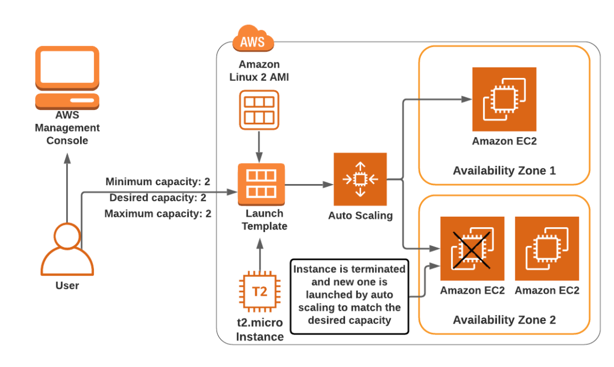
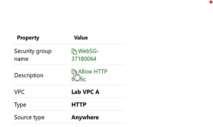
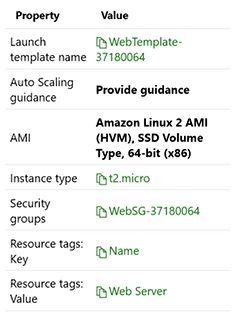
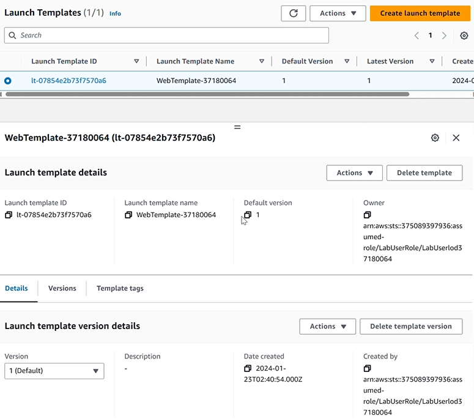
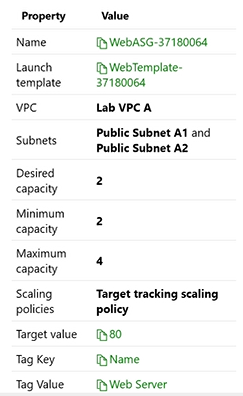
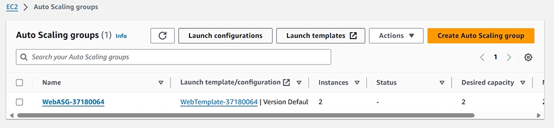
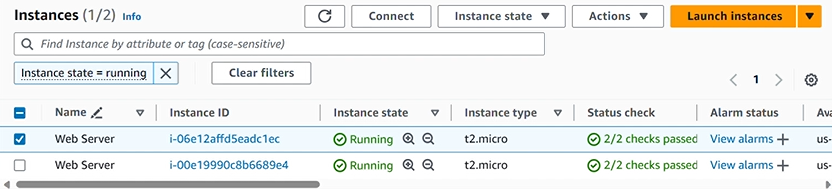
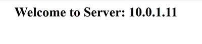

 

    
    <h3 align="center">100 Projects in Cloud</h3>

    Create an EC2 instance by using an Auto Scaling Group (ASG)
         
        Lab 13
         
    

  
<h2 style="display: inline-block">Lab Details</h2>

  <ol>
    <li><a href="#services-covered">Services covered</a></li>
    <li><a href="#lab-description">Lab description</a></li>
    <li><a href="#learning-objectives">Lab objectives</a></li>
    <li><a href="#lab-date">Lab date</a></li>
    <li><a href="#prerequisites">Prerequisites</a></li>    
    <li><a href="#lab-steps">Lab steps</a></li>
    <li><a href="#acknowledgements">Acknowledgements</a></li>
  </ol>

## Services Covered

 Elastic Cloud Computing
   Auto Scaling Group  

## Lab Description

In this challenge, Amazon Elastic Compute Cloud (Amazon EC2) instances are configured and deployed using an Auto Scaling Group (ASG). First, a security group for a launch template is created. Next, an Auto Scaling Group is created. Finally, the Auto Scaling Group is tested. 

## Learning Objectives

⭐ Create an Auto Scaling Group that automatically creates EC2 instances.

## Lab date
   2024.01.23

## Prerequisites
*AWS Account or *DigitalCloud Training Challenge Lab subscription

## Lab Steps

    1. Create a security group that allows inbound HTTP traffic. 

    

    

    2. Create a launch template. Configure a launch template that will be used with EC2 Auto Scaling.

    

    

    3. Create an Auto Scaling Group. 

    

    

    4. Test the web server instances. Go to the public IPv4 DNS address of each of the new web server instances, and then verify that the custom home page is displayed. 

    

    

    

## Acknowlegements

⭐ [Digital Cloud Challenge Labs](https://digitalcloud.training/hands-on-challenge-labs/)
