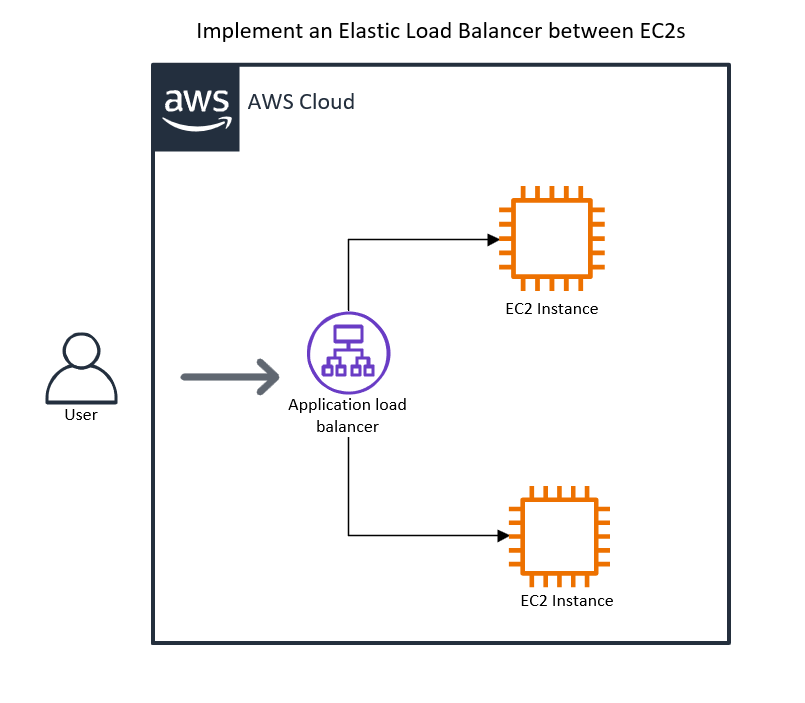

 

    
    <h3 align="center">100 Projects in Cloud</h3>

    Implement Elastic Load Balancing Between EC2 Instances
         
        Lab 14
         
    

  
<h2 style="display: inline-block">Lab Details</h2>

  <ol>
    <li><a href="#services-covered">Services covered</a></li>
    <li><a href="#lab-description">Lab description</a></li>
    <li><a href="#learning-objectives">Lab objectives</a></li>
    <li><a href="#lab-date">Lab date</a></li>
    <li><a href="#prerequisites">Prerequisites</a></li>    
    <li><a href="#lab-steps">Lab steps</a></li>
    <li><a href="#acknowledgements">Acknowledgements</a></li>
  </ol>

## Services Covered

 Elastic Cloud Computing
   Elastic Load Balancer  

## Lab Description

In this challenge, Elastic Load Balancing for two Amazon Elastic Compute Cloud (Amazon EC2) instances were configured. First, two EC2 instances as web servers were configured. Next, I created a target group that included the EC2 instances. Finally, I created a load balancer for the EC2 instances.

## Learning Objectives

⭐ Create Elastic Compute Clouds
⭐ Implement an Elastic Load Balancer to switch between the two EC2s

## Lab date
   2024.01.23

## Prerequisites
*AWS Account or *DigitalCloud Training Challenge Lab Subscription

## Lab Steps

✍️ Add a mini tutorial to encourage the reader to get started learning something new about the cloud.

### Step 1 — Summary of Step

### Step 1 — Summary of Step

### Step 3 — Summary of Step

## ☁️ Cloud Outcome

✍️ (Result) Describe your personal outcome, and lessons learned.

## Next Steps

✍️ Describe what you think you think you want to do next.

## Acknowlegements

[Digital Cloud Challenge Labs](https://digitalcloud.training/hands-on-challenge-labs/)
